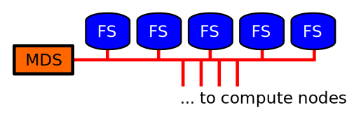

## Supercomputers @ CSC

<juha.lento@csc.fi>

--

### Overview

- What is a supercomputer?
- When to use a supercomputer?
- How to apply CSC resources?
- How to login?
- What you need to know use a supercomputer?
- How to run programs?
- Software environment
- CSC's documentation, Google keywords

--

### Course: Using CSC Environment Efficiently

The material in this lecture is covered in more detail in a whole day course
["Using CSC Environment
Efficiently"](https://www.csc.fi/web/training/-/csc-env-2019-1).

--

### How to read this

Usually the author fails to go through all the slides...but the (living) document is available on-line!

<https://bit.ly/2DetCEC>

Hit `ESC` key to see the layout, new topics go horisontally, deeper stuff is...downwards :)

---

## What is a supercomputer?

In practice all contemporary supercomputers are clusters of *tightly coupled
workstations*.

Workstations themselves are parallel computers with *multiple cores* and memory
hierarchies.

Parallel file systems run on clusters of file servers.

--

## Cluster architecture


*Login nodes*, tightly interconnected *compute nodes*, and accompanying
*parallel file system*.

--

## Compute node


Compute nodes are parallel computers with multiple cores... like your smart
phone or laptop!

--

## Parallel file system



Parallel filesystem (Lustre) consists of a MetaData Server (MDS) and
an array of large file servers (Object Data Server, ODS).

--

## Parallel file system (cont.)

**Keeping thing reasonable**

- avoid excessive metadata access.
- no more than 500 files in a single directory
- single file size < 1GB

---

## When to use a supercomputer

- need for large CPU and GPU resources
  *and a program that can use them*
    - parallel MPI programs
    - farming calculations, parameter searches etc.
- sharing large data sets
- sharing hard to install programs

--

## When not to use a supercomputer

- code development, in most cases

Weight the added complexity of supercomputer environment vs. the
increase in resources.

Optimize the workflow so that it runs fast enough in a workstation?

--

## First law of computing

First law of computing:

`$$ I \times P = C$$`

where `$I$` stands for Intelligence, `$P$` is the amount of the raw computing
Power used, and `$C$` is the difficulty of the problem (...humour).

---

## How to apply CSC resources?

1. Sign up, i.e. apply **CSC account**
    - easy if you can identify with HAKA
2. Join to a **computing project**, or apply a new one
3. Apply for **resources** to your computing project

All this stuff (and alike) is done in  
<https://sui.csc.fi>.

--

### How to apply CSC resources, tutorials

<https://research.csc.fi/csc-guide-getting-access-to-csc-services>

and

[](https://www.youtube.com/watch?v=9D7AEUDo678)
[](https://www.youtube.com/watch?v=sUYIMdd02Tc)
[](https://www.youtube.com/watch?v=eEBNOhLucDQ)


---

## How to login?

<https://research.csc.fi/csc-guide-connecting-the-servers-of-csc>

- ssh, for simple tasks
- NoMachine remote desktop, for GUI and real work

NoMachine remote desktop has big advantages over plain ssh, and needs to be set
up only once.

--

### NoMachine tips

Pleasant experience requires couple of tweaks...

- From the NoMachine window right corner peel up menu
    - if you see scroll bars, set the remote desktop size to match 1:1 to your
      window size
    -  crank up the display quality

--

### NoMachine tips (cont.)

- Use the very basic default terminal only to launch Gnome terminal(s) with easy customization, like font size, etc.
  ```bash
  gnome-terminal &
  ```
- cut'n'paste between desktop and host works... when you find the right keys...

--

### Webinar:Running RStudio using NoMachine

[](https://www.youtube.com/watch?v=qdaqAFskrB8)

---

## Supercomputing skills

Linux command line skills (which you can learn in CSC's courses "Linux 1-3"):

- working with the directory hierarchy and files
- editing text files with `nano`, `vi` or `emacs`
- optionally, how to develop and build programs in Linux

Plus the supercomputer specifics...

--

### Supercomputer environment vs. regular workstation

1. multiple versions of software packages
2. more complicated filesystem(s)
3. batch queue system

---

## How to run programs?

Computers have no common sense. They will execute every command you give, no
matter how crazy. As a human, you need to know exactly what you are asking, and
exercise your common sense.

There are quite a few important concepts...

--

### Environment modules

**What and why**: Most programs, *dynamically linked* ones, need to find the
same libraries at the executable *build time* and at the *run time*. Currently
this relies on the environment variable `LD_LIBRARY_PATH`. (Try `ldd` command!)

**How**: Set the same shell environment at build and at run time with
*environment modules*.

There are other uses for environment modules, too.

--

### What to run on a login node?

You can build executables, run small programs, pre- and post-process data,
visualize data, move data, etc. on **login nodes**, as long as it does not
affect other users on the same login node. Try `top` command!

--

### What to run on interactive compute nodes (taito-shell)?

Use `taito-shell` for longer interactive typeish tasks.

Note: `taito-shell` is just a compute node. It's local system tools are not necessary 100% same as in the login node.

--

### What to run on compute nodes?

- all heavier production calculations, whether massively parallel or farming
  type

The compute nodes are accessed through *batch queue system*.

---

## Batch queue system

Batch queue system allocates resources for your calculation from the compute
nodes according to your *batch job script*, and launces it when resources are
available. See command `sbatch`.

Batch queue system tries to pack everybody's requests into the compute nodes as
efficiently and fairly as possible.

--

### Using multiple cores for parameter searches and other farming calculations

Use [*Array jobs*](https://research.csc.fi/taito-array-jobs) for farming type
calculations.

[](https://www.youtube.com/watch?v=EqUKIPSlvW8)

--

### Using multiple cores with MPI parallel program

Batch job script is executed only on the first reserved CPU core. Use command
`srun` in the script to spawn the executable, usually a MPI parallel program, on
all the reserved CPU cores.

---

## CSC's documentation, Google keywords

All that I have covered, and \*some\* more, is in CSC on-line documentation and
webinars.

A good first guess is often found by

<form method="get" action="https://www.google.com/search" target="_blank_">
Google: <input style="color: blue; font-size: 100%; border: medium solid gray; border-radius: 0.3em;" type="text" name="q" size="31" value="CSC + software or discipline or..."></form>

--

### Some Google searches examples

- "csc environment guide", 1st hit: <https://research.csc.fi/csc-guide>
- "csc taito guide", 1st hit: <https://research.csc.fi/taito-user-guide>
- "csc courses", 2nd hit: <https://research.csc.fi/courses>
- "csc youtube", 1st hit: <https://www.youtube.com/channel/UCFv-76jNZlBFp6O9umdnyDA>
- "csc customer portal", 2nd hit: <https://sui.csc.fi>

---

## Be a programmer, not a computer!

-  **KIS**, Keep It Simple
-  **DRY**, Don't Repeat Yourself

**More** *enjoyable* **and** *productive* **working with computers**
