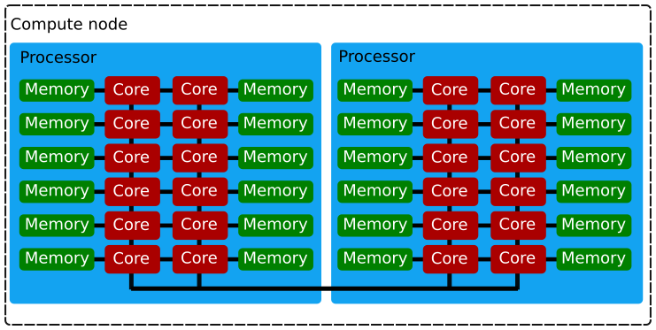
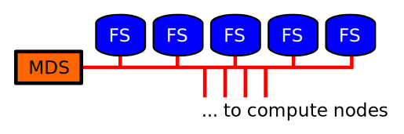

## Supercomputers @ CSC

<juha.lento@csc.fi>

---

## Overview

- What is a supercomputer?
- When to use a supercomputer?
- How to apply CSC resources?
- How to login (using NoMachine)?
- How to run programs, batch jobs, interactive nodes?
- Software environment (modules)
- CSC's documentation, Google keywords

---

## What is a supercomputer?

In practice all contemporary supercomputers are clusters of *tightly coupled
workstations*.

Processors themselves are small parallel machines with *multiple cores* and
memory hierarchies.

Parallel file systems run on clusters of file servers.

--

## Contemporary supercomputer architecture

*Login nodes*, tightly interconnected *compute nodes*, and accompanying
*parallel file system*.

--

## Compute node

Each compute node is a small (NUMA) parallel machine with multiple cores...like
your smart phone or laptop!

--

## Parallel file system

Parallel filesystem (Lustre) consists of a MetaData Server (MDS) and
an array of large file servers (Object Data Server, ODS).

--

## Parallel file system (cont.)

**Keeping thing reasonable**

- avoid excessive metadata access.
- no more than 500 files in a single directory
- single file size < 1GB

---

## When to use a supercomputer

- need for large CPU and GPU resources  
  *and have a program that can use them*
    - Parallel computing, massively parallel  
       programs (MPP)
    - farming calculations, parameter searches etc.
- sharing large data sets
- sharing hard to install programs

--

## When not to use a supercomputer

- when doing code development (in most cases)

Weight the added complexity of supercomputer environment vs. the
increase in resources.

Optimize the workflow so that it runs fast enough in a workstation?

---

## How to apply CSC resources?

<https://research.csc.fi/csc-guide-getting-access-to-csc-services>

1. Apply **CSC account**
    - easy if you can identify with HAKA
2. Join to a **computing project**, or apply a new one
3. Apply for **resources** to your computing project

All this stuff (and alike) is done in  
<https://sui.csc.fi>.

---

## How to login (using NoMachine)?

## What you need to know

-  general Linux command line skills, working with the directory
   hierarchy and files, editing text files with `vi` or `emacs`.

## How to run programs, batch jobs, interactive nodes?

- Software environment (modules)

## HPC environment vs. workstation

1. multiple versions of software packages
2. more complicated filesystem(s)
3. batch queue system

---

## CSC's documentation, Google keywords

All that I have covered, and \*some\* more, is in CSC documentation:

- 

A good first guess is often found by Google search "CSC ..." 

---

## Be a programmer, not a computer!

-  **KIS**, Keep It Simple
-  **DRY**, Don't Repeat Yourself

**More** *enjoyable* **and** *productive* **working with computers**
