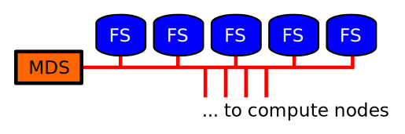

# Bootstrap

## Learning outcomes

-  how to build OpenIFS from source
-  how to run OpenIFS in a supercomputer
-  how to analyse the results

**More /enjoyable/ and /productive/ working with computers**

## Pre-requisites

-  general Linux command line skills, working with the directory
   hierarchy and files, editing text files with `vi` or `emacs`.
-  user account in `taito.csc.fi`
-  no prior experience with supercomputers is required

# Working with computers

## Golden rules

-  **KIS**, Keep It Simple
-  **DRY**, Don't Repeat Yourself

## Be a programmer, not a computer!

- bash is interpreted language, exactly like python, for example
- use bash like any other interpreted language, write programs
- command line is bash's Read-Execute-Print-Loop (REPL)

## Automate and evolve

- write tasks that you need to repeat or later review as programs
- re-use code, write re-usable code
- learn new tools
- let the machine infer values if possible, do not (re-)set them
  manually
- be efficient with editors and command line

# Contemporary supercomputers

## Architecture

Typical contemporary supercomputers consist of *login nodes*,
tightly interconnected *compute nodes*, and accompanying *parallel file
system*.

## Compute node

Each compute node is a NUMA workstation.

## Parallel file system

Parallel filesystem (Lustre) consists of a MetaData Server (MDS) and
an array of large file servers (Object Data Server, ODS).

- avoid excessive metadata access.
- no more than 500 files in a single directory
- single file size < 1GB

## Compared to workstations

1. multiple versions of software packages
2. more complicated filesystem(s)
3. batch queue system

## Use supers for

-  Parallel computing, massively parallel programs (MPP)
-  farming calculations, parameter searches etc.
-  large data sets

## Further reading

-  <http://en.wikipedia.org/wiki/Parallel_computing>
-  <https://research.csc.fi/csc-guide>
-  <https://research.csc.fi/taito-user-guide>

# Questions?
